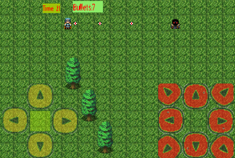
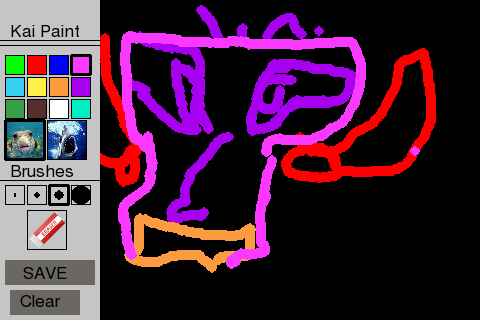

These are Android mobile applications creates by middle school and high school
kids in Palo Alto.  The applications are written in Python and use the Pygame library for 
graphics and the Pygame Subset for Android tools to the applications onto
Android.  Primary testing is done with one of these three phones: LG Optimus S,
Samsung Galaxy Note 2, Moto-G.  

##Evade

Created summer of 2013.  Ages 13-14.

---

##Swarm

Ages 13-14

---

##Paint

Ages 13-14

